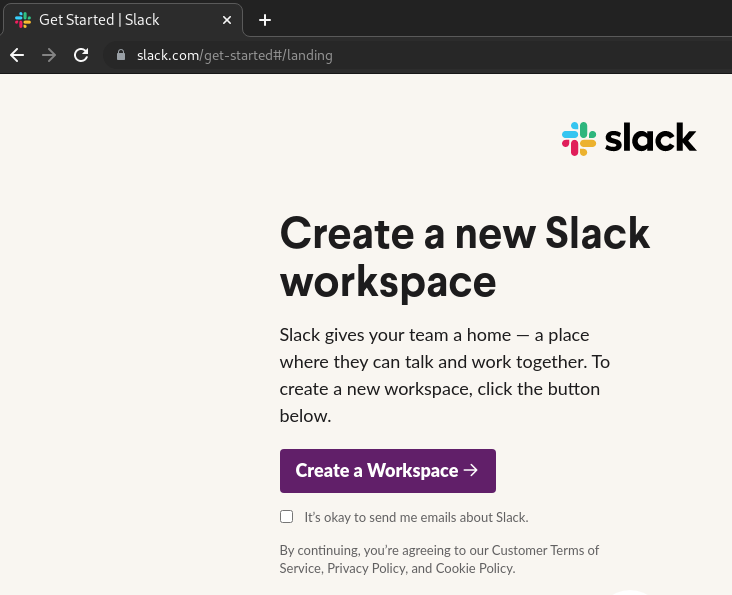
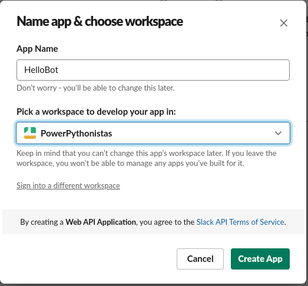
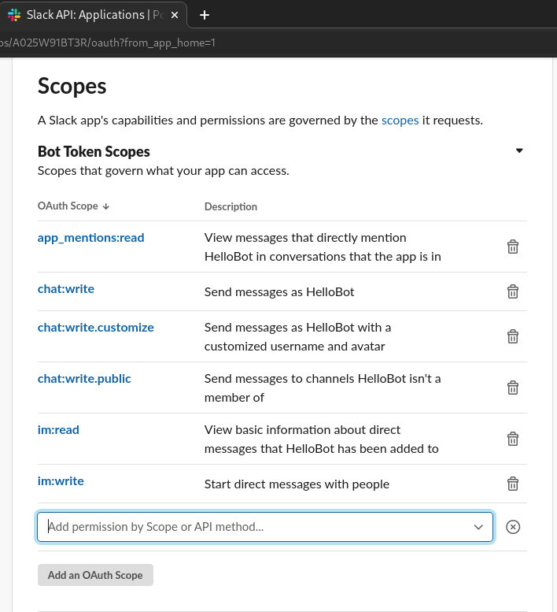
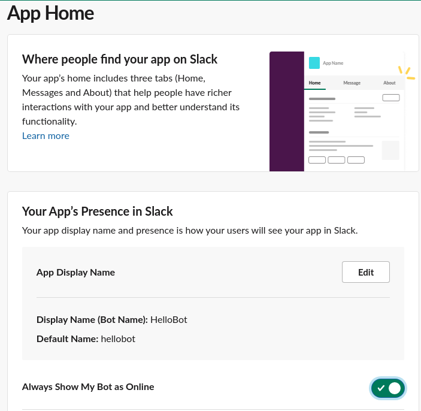
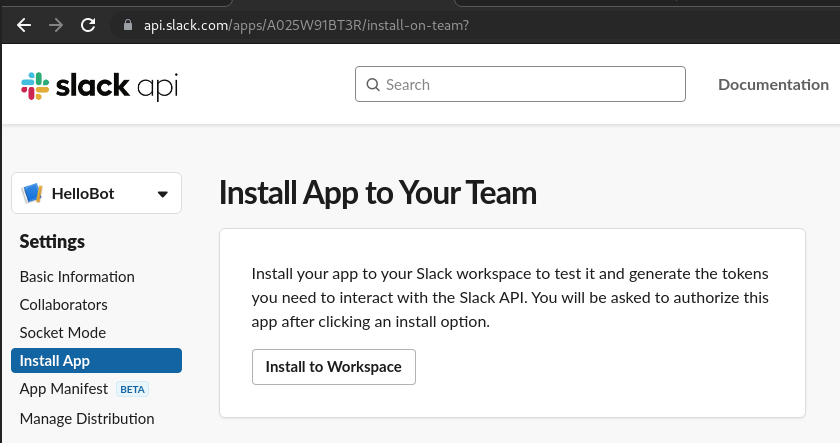

# My First Slack Bot
<p>A bot is a type of Slack App designed to interact with users via conversation.</p>
<p>When you build a bot for your Slack App, you're giving that app a face, a name, and a personality, and encouraging users to talk to it.</p>
<p>The bot can send DMs, it can be mentioned by users, it can post messages or upload files, and it can be invited to channels - or kicked out.</p>

## Install slackclient
```sh
$ pip3 install slackclient

$ pip3 freeze
aiohttp==3.7.4.post0
async-timeout==3.0.1
attrs==21.2.0
chardet==4.0.0
idna==3.2
multidict==5.1.0
slackclient==2.9.3
typing-extensions==3.10.0.0
yarl==1.6.3
```

## Create a Slack App
- Create a new slack workspace.<br>

- Navigate to https://api.slack.com/apps and create an app From scratch.

- Create a `Bot User` for the app, to use the Slack App as a bot:
  - Click on `OAuth & Permission` tab in the left sidebar.
  - In `Scopes` section, under `Bot Token Scopes`, click on `Add an OAuth Scope` and add the needed scopes.
  
  - Click on `App Home` tab in the left sidebar to see the bot user and edit the display name.
  

## Installing the app to a workspace
- Select the `Install App` button in the sidebar, `Settings` sections, to install the app in the workspace.

- Once installed, you will be able to get the Bot User OAuth Token.

## Coding the Slack Bot
- Export the Bot User OAuth Token as an environment variable.
```sh
export SLACK_BOT_TOKEN="your bot user oauth token"
```
- 

## Additional reading
- https://api.slack.com/bot-users
- https://api.slack.com/authentication/basics